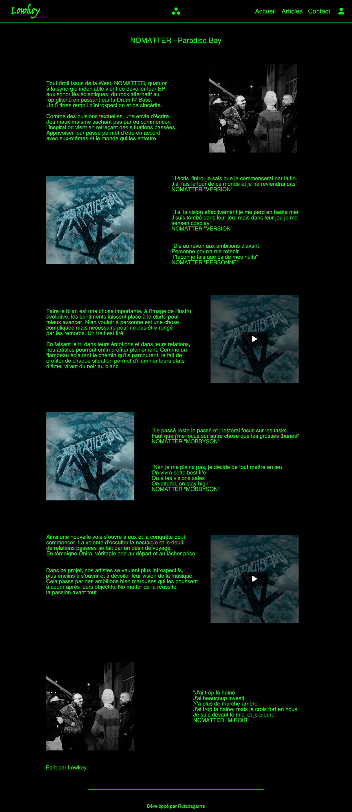

# Lowkey

Ce projet est un projet de fin de formation de 2ème année en licence informatique. Il a été réalisé par pendant 4 mois par moi-même en étant supervisé par mes professeurs.

## Présentation

Lowkey est un média de culture musicale, ils mettent en avant des artistes plus ou moins connus en expliquant le dessous des lignes afin de mieux comprendre la musique. Ce site a pour projet de leur donner une plateforme pour mettre en avant leur contenu et recenser tout leurs précédents travaux.

## Technologies

Ce projet a été réalisé avec les technologies suivantes :
- Symfony pour le back-end et la partie API
- VueJS pour le front-end

## Design

Le design a été réalisé par moi-même en suivant la direction artistique du média. Les couleurs sont donc principalement vertes et noires à leur image.

Voici quelques exemples de la maquette réalisée sur Affinity Designer :

La page d'accueil :

La page des articles :

La page de l'article :

La page d'une catégorie :
